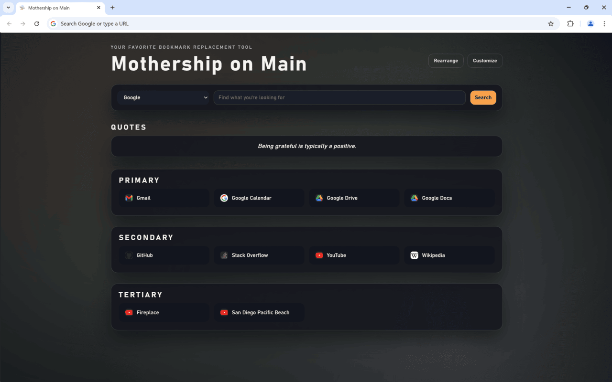
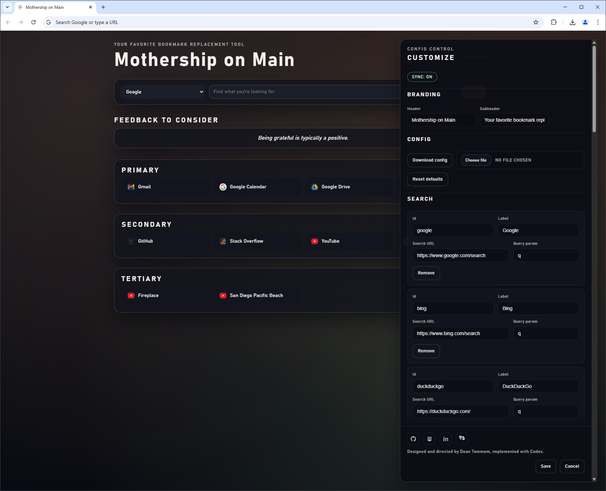

# Mothership on Main

A Chromium-enabled home and new tab replacement with a built-in Customize panel for links, backgrounds, quotes, and search engines.

<table>
    <tr>
        <td align="center">
            
        </td>
        <td align="center">
            
        </td>
    </tr>
</table>

The screenshots show the default starter links and layout shipped in the extension (not my personal URLs).

This repository started as a class project where I learned HTML, CSS, and JavaScript by building a basic version of this page. I asked Codex to refactor and modernize it, and I guided the structure, intent, and overall direction based on my prior iteration. I spent about an hour to an hour and a half tinkering with it, mostly through voice dictation in the terminal, and it was a blast. I didn't write any of the code directly; I reviewed and directed the changes and the agent implemented them.

The original inspiration came from a coworker pointing out that my clerical workflow was notably inefficient. I was inspired by [Toby](https://www.gettoby.com/) and [Momentum](https://chrome.google.com/webstore/detail/momentum/laookkfknpbbblfpciffpaejjkokdgca) for the literal functionality and took the opportunity to learn and see if I could make something like this for myself as a mini-project.

## Highlights

- New tab + home replacement with sections and rich link cards
- Built-in Customize panel with jump navigation, quick-add pills, branding, quotes, backgrounds, search engines, and links
- Favicon caching with overrides and a dynamic gradient background
- Drag to reorder sections and links on the main page and inside Customize

## Installation

1. Download this project in a location of your choosing

2. Open the extension and click `Customize` to manage links, images, quotes, and search engines.
    - Text config (links/quotes/search/sections) syncs via `chrome.storage.sync` across devices when available
    - Uploaded images and favicon overrides stay local, but export/import includes them
    - The default config lives in `config.json`

4. In Edge/Chrome, go to `Settings`, `Manage Extensions`, `Load Unpacked` and select the folder you downloaded
    - Once selected, you'll see it pop up in the list of extensions, enabled
    - Open a new tab to confirm that it worked

5. To modify in the future, open a new tab and click `Customize`. A store-published version for Chrome and Edge is coming soon.

## Usage

This extension does the following:
- Replaces your home page and new tab page
- Provides a config-backed multi-search window
- Displays quotes/notes on page load (brandable heading)
- Changes the background image on page load (including uploads, with lightweight thumbnails in Customize)
- Keeps search and link navigation in the current tab
- Allows for efficient web browser usage with custom links and favicon caching/overrides

## Customize tips

- Use the jump pills at the top of Customize to hop between sections; use the New Link/Category/Search pills for quick adds.
- Drag links directly in Customize to reorder within and across categories.
- The topmost category becomes the default for new links.
- The Quotes heading can be renamed in Customize to match your brand voice.
- Large background images are stored full-size, but the editor uses lightweight thumbnails for speed.

## Testing checklist

- Load the extension as unpacked and open a new tab; confirm the page renders without errors.
- Search: submit a query and verify it opens in the same tab.
- Links: click a link and verify it opens in the same tab; switch to Rearrange and move links/sections, then Finish.
- Customize: add a link, category, and search engine from the top pills; reorder links inside Customize.
- Import/export: export config, then import it; import quotes and confirm they replace existing lines.
- Backgrounds: switch between gradients, uploaded images, and blurred images; upload an image and confirm the dropdown switches to Uploaded images.

## License

[MIT](license)

## Credits

Thank you Coursera, Dr. Chuck, Dr. van Lent and JMK for teaching me enough about HTML, CSS and JavaScript to be able to even consider trying to make something like this.
Thank you OpenAI for providing ChatGPT and thank you ChatGPT for being an amazing tutor with unlimited patience. 
Thanks JV for the feedback on my workflow and for triggering the idea.

