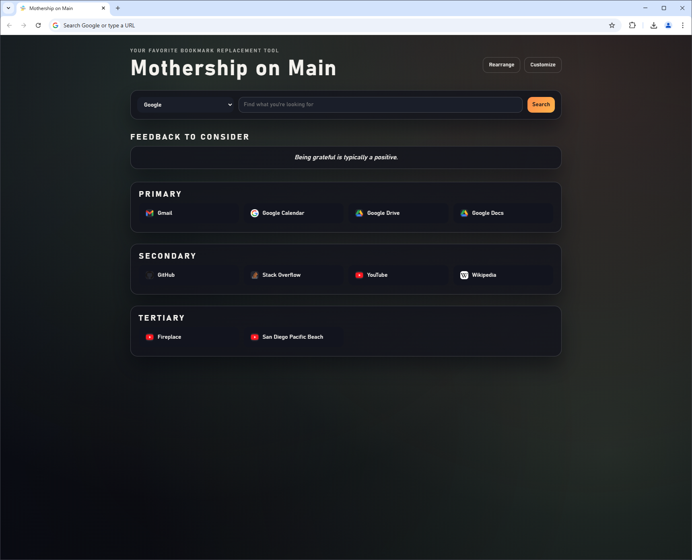

# Project Title

Mothership on Main

## Project Description

Mothership on Main is a Chromium-enabled extension that replaces your home and new tab page with an efficient view.
This is a work-in-progress project. It will require manual adjustments of elements to tailor to your liking, but a future vision of this will include interactive `Edit` buttons which will allow one to change elements from the frontend interface.

The screenshot above shows my personal implementation, which includes bookmarks I've found useful, favicons for each link and inspirational feedback I've received through time. This template has it removed for you to customize with the exception of relaxing background streams on YouTube for your watching pleasure.

The original inspiration came from a coworker pointing out that my clerical workflow was notably inefficient. I was inspired by [Toby](https://www.gettoby.com/) and [Momentum](https://chrome.google.com/webstore/detail/momentum/laookkfknpbbblfpciffpaejjkokdgca) for the literal functionality and took the opportunity to learn and see if I could make something like this for myself as a mini-project.

## Table of Contents

- [Installation](#installation)
- [Usage](#usage)
- [Contributing](#contributing)
- [License](#license)
- [Credits](#credits)
- [Contact](#contact)

## Installation

1. Download this project in a location of your choosing

2. Open index.html and update to your liking:
    - Link references and images/favicons
    - Section titles

3. Open script.js and update to your liking:
    - Texts array which display a quote per page load. If you update the entries in the array, they'll be cycled through
    - Background images which set a different background image per page load. Must be in /images and must be referenced with file name

4. In Edge/Chrome, go to `Settings`, `Manage Extensions`, `Load Unpacked` and select the folder you downloaded
    - Once selected, you'll see it pop up in the list of extensions, enabled
    - Open a new tab to confirm that it worked

5. To modify in the future, you must remove the extension, make your updates and then reload it

## Usage

This extension does the following:
- Replaces your home page and new tab page
- Provides a multi-search window which allows you to choose from multiple search providers
- Displays feedback/motivational text/notes/etc. on page load
- Changes the background image on page load
- Allows for efficient web browser usage with custom links by removing need for Bookmarks Toolbar (Disable with `Control + Shift + B`) and allowing fast opening of tab with `Control + T`

## Contributing

Feel free to submit a change! If you can make progress on making all of the elements mentioned in `Installation` interactive, it would be much appreciated. Once the functionality for modifying these elements is live, I'll plan to make this an official, published extension that will show in the Chrome web store.

## License

[MIT](license)

## Credits

Thank you Coursera, Dr. Chuck, Dr. van Lent and JMK for teaching me enough about HTML, CSS and JavaScript to be able to even consider trying to make something like this.
Thank you OpenAI for providing ChatGPT and thank you ChatGPT for being an amazing tutor with unlimited patience. 
Thanks JV for the feedback on my workflow and for triggering the idea.

## Contact

dean@tamm.am